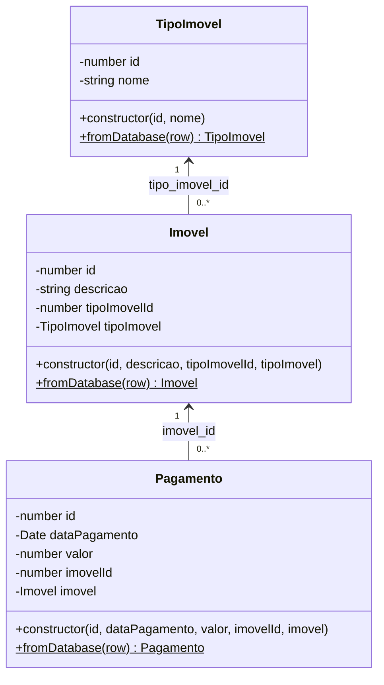

# Diagrama de Classes — Sistema Imobiliária

Modelado sobre o `schema.sql` (Integrante 1). As classes de domínio espelham
as tabelas `tipo_imovel`, `imovel` e `pagamento`.

## Correspondência tabela → classe

| Tabela SQL      | Coluna            | Classe / Atributo             |
|-----------------|-------------------|-------------------------------|
| `tipo_imovel`   | `id`              | `TipoImovel.id`               |
| `tipo_imovel`   | `nome`            | `TipoImovel.nome`             |
| `imovel`        | `id`              | `Imovel.id`                   |
| `imovel`        | `descricao`       | `Imovel.descricao`            |
| `imovel`        | `tipo_imovel_id`  | `Imovel.tipoImovelId` (FK)    |
| `pagamento`     | `id`              | `Pagamento.id`                |
| `pagamento`     | `data_pagamento`  | `Pagamento.dataPagamento`     |
| `pagamento`     | `valor` DECIMAL   | `Pagamento.valor` (Number())  |
| `pagamento`     | `imovel_id`       | `Pagamento.imovelId` (FK)     |
